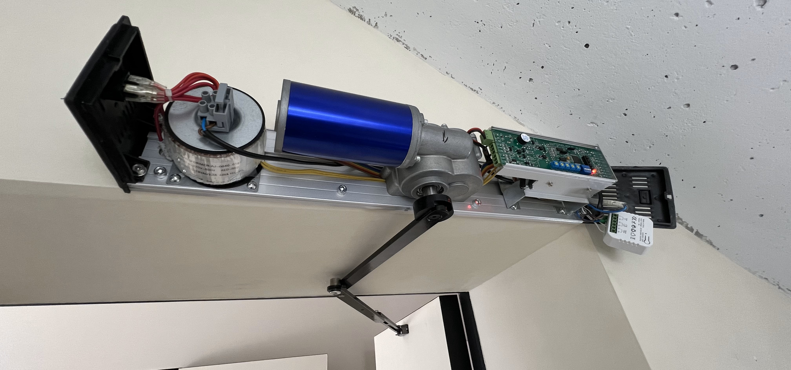
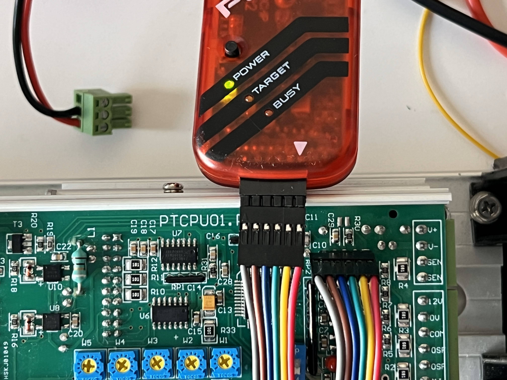

# Custom firmware for DSW-100 door driver.
## Goals:
 - safe closing
 - manual open/close using handle
 - no current consumation on idle state (BLDC is off)
## In use

 - [collision test video](./pix/door_collision_test.MOV)
 - [manual open test video](./pix/door_manual_open_test.MOV)
## Programming interface

